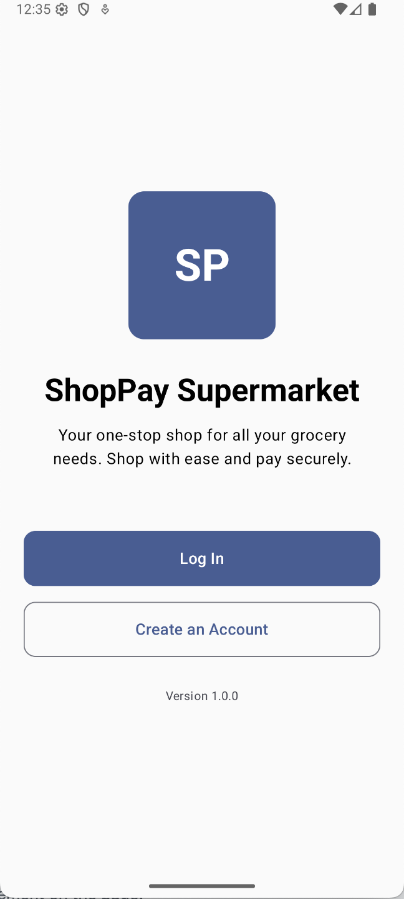
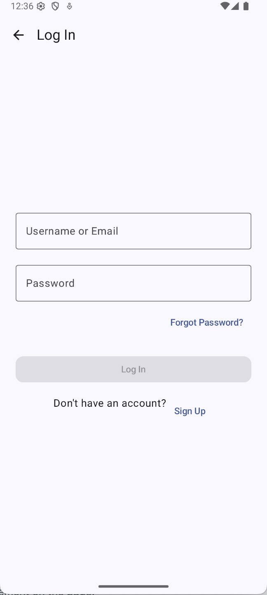
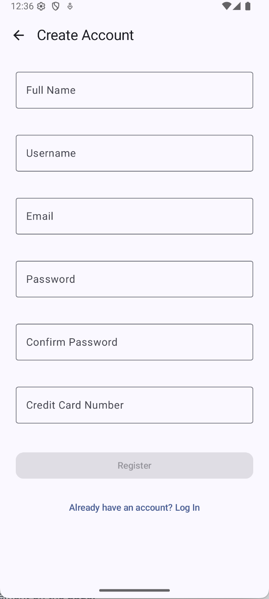
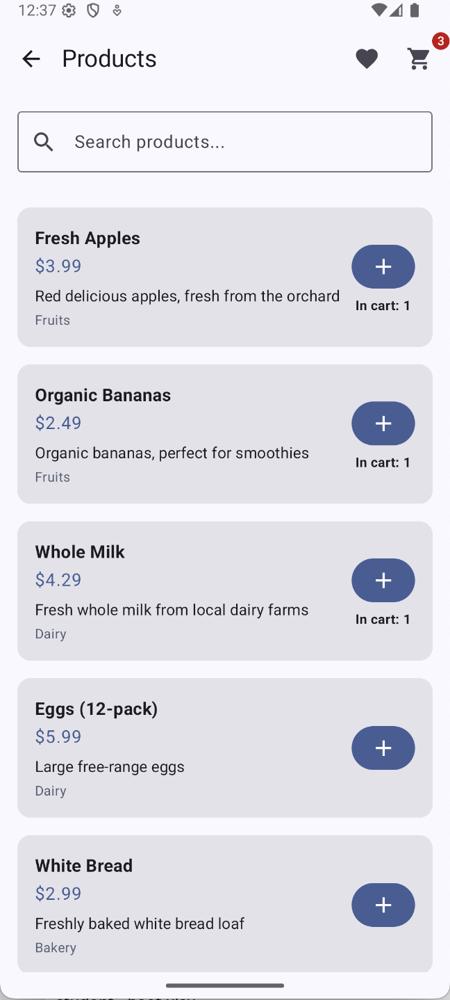
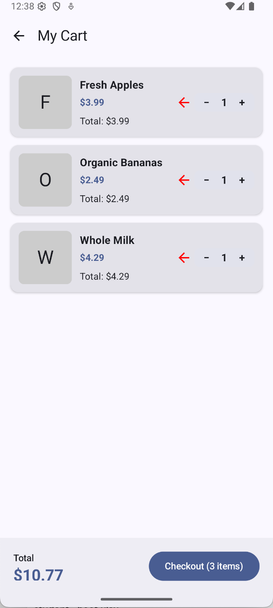

# Shop Pay Supermarket App Report

## Participants

- Nelson Campos - up202005083
- Pedro Estela - up202108892
- Marisa Azevedo - up202108624

## Overview

Shop Pay Supermarket is an Android e-commerce application built with Jetpack Compose that allows users to browse products, add them to a shopping cart, and proceed to checkout. The app provides a modern, intuitive interface designed to make grocery shopping simple and efficient.

## Core Functionalities

### User Authentication

- **Login Screen**: Allows existing users to sign in to their accounts
- **Registration Screen**: Enables new users to create accounts with personal and payment information
- **Navigation**: Easy access between authentication screens and the main app

### Product Browsing

- **Product List**: Displays all available products with images, names, descriptions, and prices
- **Search Functionality**: Allows filtering products by name, description, or category
- **Product Categories**: Products are organized by categories (Fruits, Dairy, Bakery, etc.)

### Shopping Cart

- **Add to Cart**: Add products directly from the product listing
- **Quantity Management**: Increase or decrease product quantities
- **Remove Items**: Remove products from cart individually
- **Cart Summary**: View total items and price before checkout
- **Empty Cart View**: Provides feedback when cart is empty

### UI/UX Features

- **Material Design 3**: Modern visual components following Material Design guidelines
- **Snackbar Notifications**: Provides feedback when actions are performed
- **Badge Indicators**: Shows the number of items in cart
- **Responsive Layout**: Adapts to different screen sizes and orientations

## How to Use the App

### Getting Started

1. Launch the app to reach the main screen
2. Choose either “Login” or “Register” to proceed

### Registration

1. Navigate to the Registration screen
2. Fill in the required fields:
   - Full name
   - Username
   - Email address
   - Password
   - Credit card information (if applicable)
3. Tap “Register” to create your account
4. You will be redirected to the Login screen

### Login

1. Enter your username and password
2. Tap “Login” to access the product catalog
3. Alternatively, tap “Register” if you don't have an account

### Browsing Products

1. The Product List screen displays available products
2. Use the search bar at the top to filter products by name, description, or category
3. Scroll through the list to view all products
4. Tap on a product card to view more details (future feature)

### Managing Your Cart

1. Tap the “+” button on any product card to add it to your cart
   - A snackbar notification will confirm the addition
   - The cart icon will update with the number of items
2. Tap the cart icon in the top-right corner to view your cart

### Cart Operations

1. In the Cart screen:
   - View all added products with their quantities and individual prices
   - Increase quantity: Tap the “+” button
   - Decrease quantity: Tap the “-” button
   - Remove item: Tap the remove icon
2. View the total price at the bottom of the screen
3. Tap “Checkout” to proceed to payment (future feature)
4. Tap the back arrow to return to the product list

### Navigation

- Use the back arrow in the top-left corner to navigate to previous screens
- The cart icon is accessible from the Product List screen
- Use the checkout button in the Cart screen to proceed with your purchase

## App Screenshots

Below are example screens illustrating the app interface during different usage flows:

### Home page

### Login screen

### Registration screen

### Product listing

### Shopping cart

## Technical Notes

The app is built using:

- Kotlin programming language
- Jetpack Compose UI toolkit
- Material 3 design components
- MVVM architecture pattern
- Shared state management for cart persistence

## Server-Side Architecture

The backend for Shop Pay Supermarket is built using Koa.js, a lightweight Node.js framework, and SQLite, a serverless relational database. This architecture provides an efficient, flexible, and scalable solution to handle user authentication, product catalog management, shopping cart operations, and order processing.

### Tech Stack

- **Koa.js**: A minimalistic Node.js web framework for building REST APIs.
- **SQLite**: A self-contained, serverless database that stores product data, user information, cart contents, and order histories.
- **RESTful API**: The backend exposes RESTful endpoints to allow communication between the mobile app and the server.
